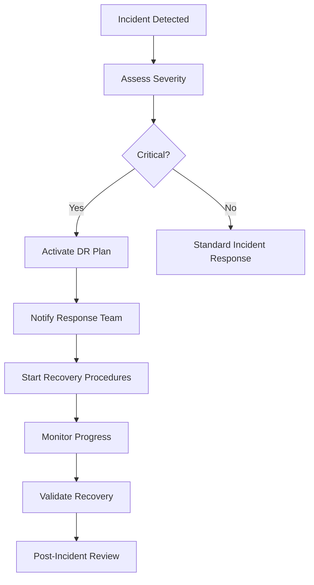

# CRYB Platform Disaster Recovery Plan

## Table of Contents

1. [Overview](#overview)
2. [Disaster Scenarios](#disaster-scenarios)
3. [Recovery Objectives](#recovery-objectives)
4. [Emergency Contacts](#emergency-contacts)
5. [Data Backup Strategy](#data-backup-strategy)
6. [Recovery Procedures](#recovery-procedures)
7. [Testing and Validation](#testing-and-validation)
8. [Post-Recovery Actions](#post-recovery-actions)
9. [Continuous Improvement](#continuous-improvement)

## Overview

This Disaster Recovery Plan outlines the procedures and protocols for recovering the CRYB platform from various disaster scenarios. The plan ensures business continuity, data protection, and rapid service restoration.

### Document Information
- **Version**: 1.0
- **Last Updated**: $(date +%Y-%m-%d)
- **Owner**: CRYB Platform Engineering Team
- **Review Frequency**: Quarterly

## Disaster Scenarios

### Critical Scenarios (RTO: 1-4 hours, RPO: 15 minutes)

1. **Complete Data Center Outage**
   - Primary cloud provider regional failure
   - Extended power outage
   - Network infrastructure failure

2. **Database Corruption/Loss**
   - PostgreSQL database corruption
   - Data consistency issues
   - Accidental data deletion

3. **Security Breach**
   - Unauthorized access to systems
   - Data exfiltration
   - Ransomware attack

4. **Application Server Failure**
   - API server cluster failure
   - Container orchestration failure
   - Critical service dependencies

### Major Scenarios (RTO: 4-8 hours, RPO: 1 hour)

1. **Storage System Failure**
   - File storage corruption
   - Media content loss
   - Backup system failure

2. **Network Partitioning**
   - DNS resolution issues
   - CDN provider outage
   - Load balancer failure

3. **Third-Party Service Outage**
   - Payment processor downtime
   - Email service provider issues
   - External API dependencies

### Minor Scenarios (RTO: 8-24 hours, RPO: 4 hours)

1. **Performance Degradation**
   - Slow response times
   - Memory leaks
   - Resource exhaustion

2. **Configuration Issues**
   - Misconfigured services
   - Certificate expiration
   - Environment variable issues

## Recovery Objectives

### Recovery Time Objective (RTO)
- **Critical Services**: 1-4 hours
- **Major Services**: 4-8 hours
- **Minor Services**: 8-24 hours

### Recovery Point Objective (RPO)
- **Database**: 15 minutes
- **User Content**: 1 hour
- **Configuration**: 4 hours

### Service Priority Matrix

| Priority | Service | RTO | RPO | Dependencies |
|----------|---------|-----|-----|--------------|
| 1 | Authentication | 1 hour | 15 min | Database, Redis |
| 1 | Core API | 1 hour | 15 min | Database, Redis |
| 1 | Database | 1 hour | 15 min | Storage |
| 2 | Web Application | 2 hours | 1 hour | API, CDN |
| 2 | Real-time Messaging | 2 hours | 1 hour | API, Redis |
| 2 | Voice/Video Services | 4 hours | 1 hour | LiveKit, API |
| 3 | Admin Panel | 8 hours | 4 hours | API |
| 3 | Mobile API | 8 hours | 4 hours | API |
| 4 | Analytics | 24 hours | 4 hours | Database |
| 4 | Monitoring | 24 hours | 4 hours | - |

## Emergency Contacts

### Primary Response Team

| Role | Name | Phone | Email | Backup |
|------|------|-------|-------|--------|
| Incident Commander | [Name] | [Phone] | [Email] | [Backup] |
| Technical Lead | [Name] | [Phone] | [Email] | [Backup] |
| Database Administrator | [Name] | [Phone] | [Email] | [Backup] |
| Security Officer | [Name] | [Phone] | [Email] | [Backup] |
| Communications Lead | [Name] | [Phone] | [Email] | [Backup] |

### External Contacts

| Service | Contact | Phone | Email | Account ID |
|---------|---------|-------|-------|------------|
| AWS Support | Enterprise | +1-xxx-xxx-xxxx | aws-support@cryb.ai | [Account ID] |
| CloudFlare | Enterprise | +1-xxx-xxx-xxxx | cf-support@cryb.ai | [Account ID] |
| Database Vendor | PostgreSQL Pro | +1-xxx-xxx-xxxx | db-support@cryb.ai | [Account ID] |
| Monitoring Vendor | DataDog | +1-xxx-xxx-xxxx | monitoring@cryb.ai | [Account ID] |

### Escalation Matrix

1. **Level 1** (0-30 minutes): On-call engineer
2. **Level 2** (30-60 minutes): Technical lead + Incident commander
3. **Level 3** (60+ minutes): CTO + CEO + All senior engineers
4. **External** (2+ hours): Vendor support + Legal team

## Data Backup Strategy

### Backup Types

1. **Database Backups**
   - **Frequency**: Every 15 minutes (streaming replication)
   - **Full Backup**: Daily at 2 AM UTC
   - **Retention**: 30 days full, 1 year incrementals
   - **Location**: Multi-region S3 with cross-region replication

2. **Application Data**
   - **Frequency**: Hourly snapshots
   - **Full Backup**: Daily
   - **Retention**: 7 days snapshots, 30 days full
   - **Location**: Distributed across 3 availability zones

3. **Configuration Backups**
   - **Frequency**: On every deployment
   - **Retention**: 90 days
   - **Location**: Git repository + S3 versioning

4. **User Content**
   - **Frequency**: Real-time replication
   - **Retention**: Indefinite (with versioning)
   - **Location**: Multi-region object storage

### Backup Verification

- **Daily**: Automated backup integrity checks
- **Weekly**: Test restore procedures on staging
- **Monthly**: Full disaster recovery simulation
- **Quarterly**: Cross-region failover testing

## Recovery Procedures

### Incident Response Process



### Database Recovery

#### Scenario: PostgreSQL Database Failure

**Detection:**
- Monitoring alerts indicate database unavailability
- Application health checks failing
- Connection pool exhaustion

**Immediate Actions (0-15 minutes):**
1. Execute database health check: `./scripts/check-database-health.sh`
2. Attempt automatic failover to standby replica
3. If failover fails, assess damage extent

**Recovery Steps (15-60 minutes):**
1. **Stop all application services**
   ```bash
   ./disaster-recovery/scripts/stop-all-services.sh
   ```

2. **Assess database state**
   ```bash
   ./disaster-recovery/scripts/assess-database-damage.sh
   ```

3. **Restore from backup**
   ```bash
   ./disaster-recovery/scripts/restore-database.sh [backup-timestamp]
   ```

4. **Verify data integrity**
   ```bash
   ./disaster-recovery/scripts/verify-database-integrity.sh
   ```

5. **Start services gradually**
   ```bash
   ./disaster-recovery/scripts/gradual-service-start.sh
   ```

### Application Server Recovery

#### Scenario: Complete Application Cluster Failure

**Immediate Actions (0-30 minutes):**
1. Switch DNS to maintenance page
2. Notify users via status page and social media
3. Assess infrastructure state

**Recovery Steps (30-120 minutes):**
1. **Deploy to backup region**
   ```bash
   ./disaster-recovery/scripts/deploy-to-backup-region.sh
   ```

2. **Restore database to backup region**
   ```bash
   ./disaster-recovery/scripts/restore-database-cross-region.sh
   ```

3. **Update DNS and routing**
   ```bash
   ./disaster-recovery/scripts/update-dns-failover.sh
   ```

4. **Verify service functionality**
   ```bash
   ./disaster-recovery/scripts/verify-services.sh
   ```

### Security Breach Recovery

#### Scenario: Confirmed Security Breach

**Immediate Actions (0-15 minutes):**
1. **Isolate affected systems**
   ```bash
   ./disaster-recovery/scripts/isolate-compromised-systems.sh
   ```

2. **Preserve evidence**
   ```bash
   ./disaster-recovery/scripts/preserve-forensic-evidence.sh
   ```

3. **Notify stakeholders**
   - Security team
   - Legal team
   - Regulatory bodies (if required)

**Recovery Steps (15-240 minutes):**
1. **Assess breach scope**
   ```bash
   ./disaster-recovery/scripts/assess-breach-scope.sh
   ```

2. **Rebuild compromised systems**
   ```bash
   ./disaster-recovery/scripts/rebuild-compromised-infrastructure.sh
   ```

3. **Restore from clean backups**
   ```bash
   ./disaster-recovery/scripts/restore-from-clean-backups.sh
   ```

4. **Implement additional security measures**
   ```bash
   ./disaster-recovery/scripts/enhance-security-posture.sh
   ```

5. **Notify affected users**
   ```bash
   ./disaster-recovery/scripts/notify-affected-users.sh
   ```

## Recovery Scripts

### Core Recovery Scripts

1. **`/disaster-recovery/scripts/master-recovery.sh`**
   - Main recovery orchestration script
   - Determines recovery strategy based on scenario
   - Coordinates all recovery activities

2. **`/disaster-recovery/scripts/database-recovery.sh`**
   - Database-specific recovery procedures
   - Point-in-time recovery capabilities
   - Data integrity verification

3. **`/disaster-recovery/scripts/infrastructure-recovery.sh`**
   - Infrastructure provisioning and configuration
   - Multi-region deployment capabilities
   - Service health verification

4. **`/disaster-recovery/scripts/security-recovery.sh`**
   - Security incident response procedures
   - System hardening and remediation
   - Evidence preservation and analysis

### Utility Scripts

1. **`/disaster-recovery/scripts/backup-validation.sh`**
   - Validates backup integrity and completeness
   - Tests restore procedures
   - Generates backup health reports

2. **`/disaster-recovery/scripts/communication.sh`**
   - Automated status page updates
   - Stakeholder notifications
   - Social media announcements

3. **`/disaster-recovery/scripts/monitoring.sh`**
   - Recovery progress monitoring
   - Performance metrics collection
   - Alert management during recovery

## Testing and Validation

### Recovery Testing Schedule

| Test Type | Frequency | Duration | Scope |
|-----------|-----------|----------|-------|
| Database Recovery | Monthly | 2 hours | Full database restore |
| Application Recovery | Quarterly | 4 hours | Complete application stack |
| Cross-Region Failover | Semi-annually | 8 hours | Full infrastructure failover |
| Security Incident Response | Annually | 1 day | Complete security breach simulation |

### Test Procedures

#### Monthly Database Recovery Test
1. **Preparation**
   - Schedule maintenance window
   - Notify stakeholders
   - Prepare test environment

2. **Execution**
   - Create point-in-time backup
   - Simulate database failure
   - Execute recovery procedures
   - Verify data integrity

3. **Validation**
   - Compare data consistency
   - Verify application functionality
   - Document lessons learned

#### Quarterly Application Recovery Test
1. **Preparation**
   - Create test environment
   - Document current state
   - Prepare monitoring

2. **Execution**
   - Simulate application failure
   - Execute recovery procedures
   - Measure RTO and RPO

3. **Validation**
   - Verify all services operational
   - Test user scenarios
   - Update procedures based on findings

### Success Criteria

- **RTO Achievement**: Recovery completed within target time
- **RPO Achievement**: Data loss within acceptable limits
- **Functionality**: All critical services operational
- **Performance**: System performance within 90% of baseline
- **Communication**: All stakeholders properly notified

## Post-Recovery Actions

### Immediate Actions (0-2 hours after recovery)

1. **Service Verification**
   - Execute comprehensive health checks
   - Verify all critical user flows
   - Monitor system performance

2. **Communication**
   - Update status page with resolution
   - Notify all stakeholders
   - Prepare internal communication

3. **Monitoring**
   - Increase monitoring frequency
   - Watch for secondary issues
   - Monitor user feedback

### Short-term Actions (2-24 hours after recovery)

1. **Performance Monitoring**
   - Monitor system stability
   - Track user engagement metrics
   - Identify any lingering issues

2. **Data Validation**
   - Verify data consistency
   - Check for any data loss
   - Validate business metrics

3. **Security Assessment**
   - Review security logs
   - Assess any security implications
   - Update security measures if needed

### Long-term Actions (1-7 days after recovery)

1. **Post-Incident Review**
   - Conduct thorough incident analysis
   - Document lessons learned
   - Identify improvement opportunities

2. **Process Updates**
   - Update recovery procedures
   - Revise monitoring and alerting
   - Update documentation

3. **Training and Preparation**
   - Update team training materials
   - Schedule additional training if needed
   - Review and update contact lists

## Post-Incident Review Process

### Review Meeting (Within 48 hours)

**Attendees:**
- Incident Commander
- Technical Lead
- All team members involved in recovery
- Stakeholders as appropriate

**Agenda:**
1. Timeline review
2. What went well
3. What could be improved
4. Action items and owners
5. Documentation updates needed

### Action Item Tracking

| Action Item | Owner | Due Date | Status | Priority |
|-------------|-------|----------|--------|----------|
| Update monitoring thresholds | DevOps Lead | [Date] | Open | High |
| Improve backup verification | Database Admin | [Date] | Open | Medium |
| Update runbooks | Technical Lead | [Date] | Open | Medium |
| Enhance team training | Incident Commander | [Date] | Open | Low |

### Improvement Implementation

1. **Immediate Fixes** (0-7 days)
   - Critical process gaps
   - Monitoring improvements
   - Documentation updates

2. **Short-term Improvements** (1-4 weeks)
   - Process enhancements
   - Tool improvements
   - Additional monitoring

3. **Long-term Initiatives** (1-3 months)
   - Infrastructure improvements
   - Major process overhauls
   - Investment in new tools

## Continuous Improvement

### Metrics and KPIs

1. **Recovery Metrics**
   - Mean Time to Detection (MTTD)
   - Mean Time to Recovery (MTTR)
   - Recovery Point Objective (RPO) achievement
   - Recovery Time Objective (RTO) achievement

2. **Preparedness Metrics**
   - Backup success rate
   - Test execution frequency
   - Team response time
   - Documentation completeness

3. **Business Impact Metrics**
   - Revenue impact during downtime
   - User impact and churn
   - Customer satisfaction scores
   - Reputation impact assessment

### Regular Reviews

#### Monthly Reviews
- Review incident trends
- Assess backup health
- Update contact information
- Review and update procedures

#### Quarterly Reviews
- Comprehensive plan review
- Update based on infrastructure changes
- Review and update RTO/RPO targets
- Conduct major recovery tests

#### Annual Reviews
- Complete plan overhaul
- Industry best practice assessment
- Regulatory compliance review
- Team training and certification

### Training and Awareness

#### New Team Member Onboarding
- Disaster recovery plan overview
- Role-specific training
- Hands-on recovery simulation
- Documentation familiarization

#### Ongoing Training
- Monthly tabletop exercises
- Quarterly hands-on drills
- Annual comprehensive simulation
- External training and certification

#### Knowledge Management
- Maintain up-to-date runbooks
- Document lessons learned
- Share knowledge across teams
- Regular knowledge transfer sessions

## Appendices

### Appendix A: Emergency Contact Cards
[Physical contact cards for wallet/phone]

### Appendix B: Recovery Checklists
[Quick reference checklists for each scenario]

### Appendix C: Communication Templates
[Pre-written templates for various stakeholder communications]

### Appendix D: Technical Diagrams
[Infrastructure diagrams and dependencies]

### Appendix E: Vendor Information
[Detailed vendor contact information and procedures]

---

**Document Control:**
- **Approval**: [Name], [Title], [Date]
- **Next Review**: [Date]
- **Distribution**: All engineering team members, management team, key stakeholders